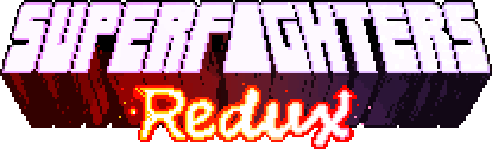
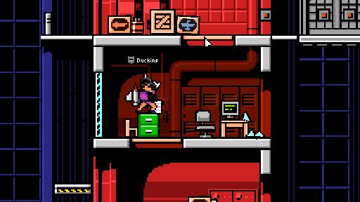
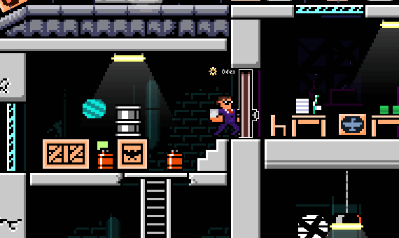
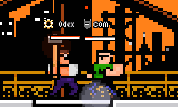
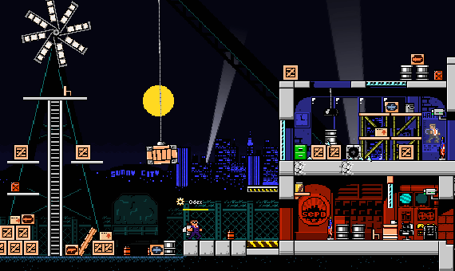

# F.A.Q.
> [!NOTE]
> This mod is still a work-in-progress. Features may break, be added, removed, or changed entirely.

### What is it?
SFR is an open source mod for [Superfighters Deluxe](https://mythologicinteractive.com/SuperfightersDeluxe). It adds new content and tweaks existing mechanics for a better game experience.

### Do you have devs consent?
Yes, we do. However read the full [license](https://github.com/Odex64/SFR/blob/master/LICENSE) for some clarification.

### I have some issues
Reach us through [Discord](https://discord.gg/UbbCs2kywd).

# Features

## Skins
There are tons of new items and colors you can equip. Some of theme even have a tertiary color.

## Weapons
There are over 40 new weapons and makeshifts, some of them with unique mechanics.

## Tiles
Unleash your creativity with a huge collection of new tiles and colors.

## Gore
Watch your opponents' guts and heads as you kill them. 

## Much more
There's new music, sounds, triggers, increased slots, special items and whatnot.

# How to install
### Download
You can download the latest version [here](https://github.com/Odex64/SFR/releases).

### Installation
Extract the downloaded archive in your `Superfighters Deluxe` folder (if you have a previous SFR installation, make sure to delete that). 
Open steam and change `Superfighters Deluxe` launch options to `cmd /k "%command%\..\SFR.exe"`.
  

# Developing your own mods
For developing your own mods, follow the [contributing](https://github.com/Odex64/SFR/blob/master/CONTRIBUTING.md) guide.
