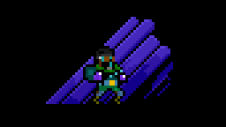
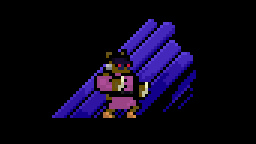

> [!IMPORTANT]
> This mod is still a work-in-progress. Features may break, be added, removed, or changed entirely.

FAQ

## What is it?
SFR is an open source mod for [Superfighters Deluxe](https://mythologicinteractive.com/SuperfightersDeluxe). It adds new content and tweaks existing mechanics for a better game experience.

## Do you have devs consent?
Yes, we do. However read the full [license](https://github.com/Odex64/SFR/blob/master/LICENSE) for some clarification.

## I have some issues
Reach us through [Discord](https://discord.gg/UbbCs2kywd).

Features

## Skins
There are tons of new items and colors you can equip. Some of them even have a tertiary color.

## Weapons
There are over 40 new weapons and makeshifts, some of them with unique mechanics.

## Tiles
Unleash your creativity with a huge collection of new tiles and colors.

## Much more
There's new music, sounds, triggers, gore, increased slots, special items and whatnot.

Installation

## Download
You can download the latest version [here](https://github.com/Odex64/SFR/releases).

## Setup
1. Extract the downloaded archive in your `Superfighters Deluxe` folder (if you have a previous SFR installation, make sure to delete that).
2. Open steam and change `Superfighters Deluxe` launch options to `cmd /k "%command%\..\SFR.exe"`.

